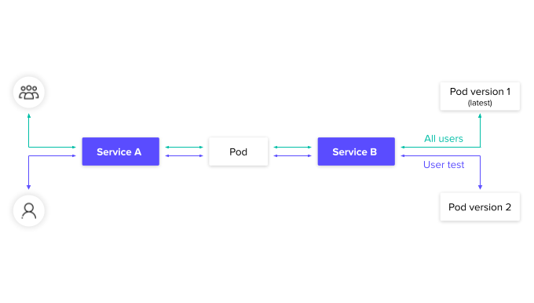

<p align="center"></p>
<p style="font-size: 40px" align="center"><b>Dynamic Environment</b></p>

<p align="center">
  <a href="https://github.com/Riskified/dynamic-environment/actions?query=workflow%3Amain-build"></a>
  <a href="https://github.com/Riskified/dynamic-environment/releases/latest"></a>
  <a href="http://www.apache.org/licenses/LICENSE-2.0"></a>
</p>

DynamicEnv is an innovative Kubernetes operator designed to empower developers by simplifying the process of launching on-demand environments. At its core, DynamicEnv offers a streamlined approach to deploying and testing different versions of specific services within a shared Kubernetes cluster.

It effectively deals with the issues mentioned by creating special versions just for the services being tested. At the same time, it makes smart use of the 'production' versions for the rest of the environment, ensuring efficient resource use. The traffic is cleverly directed, sending 'real' users to the 'production' version of services and directing the traffic of a test user to the specific test version.

<p align="center"></p>

<p align="center">
  <br />
  <a href="https://riskified.github.io/dynamic-environment-docs/" rel="dofollow"><strong>Explore the docs »</strong></a>
  <br />
</p>

## Development Setup

This section describes how to create a working environment for developing _Dynamic Environment_.
While it's not mandatory to follow these instructions or use the same tools, it's highly recommended
to keep the versions and some install procedures (e.g, _Istio_ installation into kubernetes) to make
sure everything passes the tests correctly.

### Tool Versions

In order to have consistent results across development, tests, etc. we use a specific version of
each of the tools. The repository contains [asdf][] configuration for each of the tools we use
during development/testing. The tools and versions required are configured in the `.tool-versions`
file at the top of the repository. Below is the procedure to install the required tool via _asdf_:

After [installing asdf][asdf-inst] install the required plugins (it's safe to run this command even
if some tools are already installed):

```shell
for tool in `cat .tool-versions |cut -d" " -f1`; do asdf plugin add $tool; done
```

Then run the following command in the root of the repository (again, it's safe to run this even if
some tools are already installed):

```shell
asdf install
```

You should now have the right versions of the tools installed. As long as you installed _asdf_
correctly, and you're running from within the repository root you'll be using the right versions.

Here are other tools, that while not required, can make life easier:

* `kubectl`: Make sure it's a version that matches our cluster version according to the [version
  skew policy][skew] (if you don't want to mess with multiple versions, and you're using minikube
  you can use `minikube kubectl` instead).
* `kubectx` and `kubens`: Will help you set the context and default namespace easily.
* `k9s`: A great tool for interacting with k8s from the command line. Check the [website][k9s] for
  usage.

### Prepare task

Some of the development requirements are installed via the `Makefile`'s `prepare` task. Run it to
install requirements:

```shell
make prepare
```

## Setting up Kubernetes

After we have the tools we need, it's time to install two kubernetes clusters. One for Development and one for
running tests locally. Below is an optional suggestion for installing and configuring these
clusters. Feel free to replace all the components except _KInd_ (so your test setup will be as
similar to the _CI_ as possible).

### Development Cluster

We will use [minikube][] as our development cluster. Feel free to use whichever cluster suits you
best, but try to preserve the kubernetes version.

After installing minikube we need to start a new
cluster. You can play a little with the _memory_ and the _cpus_ but since we're going to run
resources on it, it's better to give it more resources than the default:

```shell
minikube start --kubernetes-version v1.26.3 --memory 8g --cpus 4
```

For the rest of the command make sure your _kubectl_ is operating on the minikube context:

```shell
kubectx -c # should return 'minikube'
```

Next, install Istio:

```shell
istioctl install --set profile=demo -y
```

If you want some basic building blocks to play with, you can install a slightly modified version of
the _Istio_ _BookInfo_ application, so you'll have some application to experiment on. This command
will install _BookInfo_ environment on a newly created _services_ namespace. It will also apply
required labels (note that if you're not using these resources you have to apply the
`istio-injection=enabled` label on any namespace you want istio to operate on)`:

```shell
kubectl apply -n services -f dev-resources

# Alternatively, if you don't want to install these manifests you have to apply an istio label
# on each namespace you want istio to operate on
kubectl label namespace <NAMESPACE> istio-injection=enabled
```

_Note: On Mac, minikube might start to use a lot of resources if left running for a couple of days.
It's better to stop minikube when you're done working for the day_.

### Tests Cluster

Some tests should run against a dedicated cluster. It is recommended that you'll have a
default named _Kind_ cluster for testing.

A prerequisite for running _Kind_ is a docker service. Make sure you have one installed (e.g,
_Rancher Desktop_). Assuming you followed the instructions above you should have the right version
of _Kind_ installed.

Create the default _Kind_ cluster:

```shell
./e2e-testing/scripts/setup.sh create
```

Install required dependencies and controller docker image:

```shell
./e2e-testing/scripts/setup.sh deps
```

`

**From now on make sure your k8s context points to the test cluster.**

Deploy the controller to the cluster (this step should be repeated every time you update the
controller code):

```shell
./e2e-testing/scripts/setup.sh deploy
````

If you want to clean up the test cluster you can run one of the following commands:

```shell
# Undeploy the controller and dependencies
./e2e-testing/scripts/setup.sh down

# Completely delete the cluster
./e2e-testing/scripts/setup.sh delete
```

## Running the Operator Locally for Development

The development cluster is meant to be used as a target for our development process. As such, it's
missing some components:

* Validating webhook.
* Metrics

To run our development operator:

```shell
make install run
```

> Note: if you run in development mode not using the `Makefile` add `-zap-devel` to your parameters
> for better development logging.

On another shell session you can deploy a sample _dynamic-environment_ resource to see the effect:

```shell
kubectl create -f config/samples/riskified_v1alpha1_dynamicenv.yaml
```

This will install a _dynamic-environment_ resource in the _default_ namespace. Check the status and
the various resources on the _services'_ namespace.

## Writing Tests

There are two types of tests for this controller:

* [Unit Tests](#unit-tests)
* [End-to-End Tests](#e2e-tests)

### Unit Tests

These are the regular _go_ tests.

### E2E Tests

These are tests against a real cluster ([Kind][kind]). We write and run the tests using [kuttl][].
Each _Kuttl_ test should be located each in its own directory under `./e2e-testing/kuttl`. Make
sure you follow the rules for creating tests:

* Your first test manifest should create a new namespace (preferably named like your test directory)
  and all test resources (deployments, destination rules, virtual services, etc.) should be deployed
  to that namespace. If required create more than one namespace. This will prevent collisions
  between test cases.
* Every namespace added (per the previous step) should contain an _Istio_ namespace:
    ```yaml
    apiVersion: v1
    kind: Namespace
    metadata:
      name: <NAME>
      labels:
        istio-injection: enabled
    ```
* The tested _dynamic-environment_ yaml could be deployed to the default namespace (with resources
  pointing to the namespaces above).
* If there are any leftover namespaces in the cluster (should not happen - this problem was fixed in
  _Kuttl_) remove then manually.
* Add a `Readme.md` file in each test directory describing the test target (and optionally pointing
  to the relevant ticket).

You can run the specific test you're working on (`<TEST_NAME>` is the directory of the test):

```shell
kuttl test --start-kind=false -n default --timeout 20 ./e2e-testing/kuttl --test <TEST_NAME>
```

## Running Tests

* Run all unit tests with: `make test`
* Run all E2E tests with: `make kuttl`

## Running Linters

While we run default linters during our _test_ stage, it's advisable to occasionally run other
linters. These should not break the build (and not included in our configuration) and might contain
a lot of false positives, however you should occasionally run them to manually search for errors:

```shell
# get a list of linters (at the end of the output there are some convenient presets)
golangci-lint help linters

# run specific presets (e.g. complexity and error)
golangci-lint run -p complexity,error
```

[asdf]: https://asdf-vm.com/

[asdf-inst]: https://asdf-vm.com/guide/getting-started.html

[kind]: https://kind.sigs.k8s.io/

[kuttl]: https://kuttl.dev/

[minikube]: https://minikube.sigs.k8s.io/

[skew]: https://kubernetes.io/releases/version-skew-policy/

[k9s]: https://k9scli.io/
